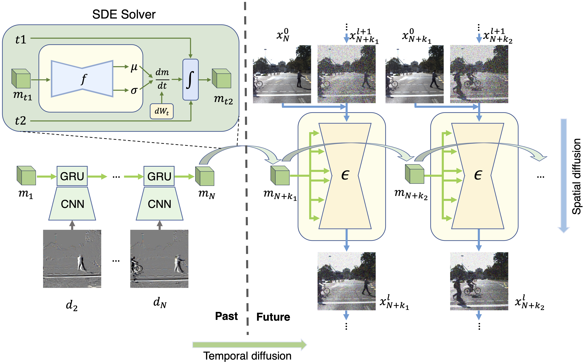
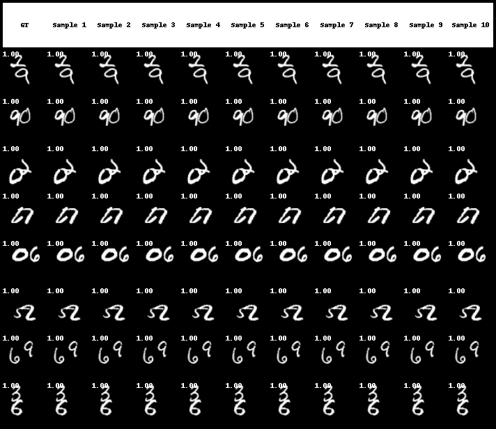

# STDiff: Spatio-temporal diffusion for continuous stochastic video prediction</h1>
[arXiv](https://arxiv.org/abs/2312.06486) | [code](https://github.com/XiYe20/STDiffProject)


<h3 align="center">  </h3>

## Overview
<p align="center">

</p>

## Installation
1. Install the custom diffusers library
```bash
git clone https://github.com/XiYe20/CustomDiffusers.git
cd CustomDiffusers
pip install -e .
```
2. Install the requirements of STDiff
```bash
pip install -r requirements.txt
```

## Datasets

Processed KTH dataset: https://drive.google.com/file/d/1RbJyGrYdIp4ROy8r0M-lLAbAMxTRQ-sd/view?usp=sharing \
SM-MNIST: https://drive.google.com/file/d/1eSpXRojBjvE4WoIgeplUznFyRyI3X64w/view?usp=drive_link

For other datasets, please download them from the official website. Here we show the dataset folder structure.

#### BAIR
Please download the original BAIR dataset and utilize the "/utils/read_BAIR_tfrecords.py" script to convert it into frames as follows:

/BAIR \
  &nbsp;&nbsp;&nbsp;&nbsp; test/ \
  &nbsp;&nbsp;&nbsp;&nbsp;&nbsp;&nbsp;&nbsp;&nbsp; example_0/ \
  &nbsp;&nbsp;&nbsp;&nbsp;&nbsp;&nbsp;&nbsp;&nbsp;&nbsp;&nbsp;&nbsp; 0000.png \
  &nbsp;&nbsp;&nbsp;&nbsp;&nbsp;&nbsp;&nbsp;&nbsp;&nbsp;&nbsp;&nbsp; 0001.png \
  &nbsp;&nbsp;&nbsp;&nbsp;&nbsp;&nbsp;&nbsp;&nbsp;&nbsp;&nbsp;&nbsp; ... \
  &nbsp;&nbsp;&nbsp;&nbsp;&nbsp;&nbsp;&nbsp;&nbsp; example_1/ \
  &nbsp;&nbsp;&nbsp;&nbsp;&nbsp;&nbsp;&nbsp;&nbsp;&nbsp;&nbsp;&nbsp; 0000.png \
  &nbsp;&nbsp;&nbsp;&nbsp;&nbsp;&nbsp;&nbsp;&nbsp;&nbsp;&nbsp;&nbsp; 0001.png \
  &nbsp;&nbsp;&nbsp;&nbsp;&nbsp;&nbsp;&nbsp;&nbsp;&nbsp;&nbsp;&nbsp; ... \
  &nbsp;&nbsp;&nbsp;&nbsp;&nbsp;&nbsp;&nbsp;&nbsp; example_... \
&nbsp;&nbsp;&nbsp;&nbsp; train/ \
  &nbsp;&nbsp;&nbsp;&nbsp;&nbsp;&nbsp;&nbsp;&nbsp; example_0/ \
  &nbsp;&nbsp;&nbsp;&nbsp;&nbsp;&nbsp;&nbsp;&nbsp;&nbsp;&nbsp;&nbsp; 0000.png \
  &nbsp;&nbsp;&nbsp;&nbsp;&nbsp;&nbsp;&nbsp;&nbsp;&nbsp;&nbsp;&nbsp; 0001.png \
  &nbsp;&nbsp;&nbsp;&nbsp;&nbsp;&nbsp;&nbsp;&nbsp;&nbsp;&nbsp;&nbsp; ... \
  &nbsp;&nbsp;&nbsp;&nbsp;&nbsp;&nbsp;&nbsp;&nbsp; example_... 

#### Cityscapes
Please download "leftImg8bit_sequence_trainvaltest.zip" from the official website. Center crop and resize all the frames to the size of 128X128. Save all the frames as follows:

/Cityscapes \
  &nbsp;&nbsp;&nbsp;&nbsp; test/ \
  &nbsp;&nbsp;&nbsp;&nbsp;&nbsp;&nbsp;&nbsp;&nbsp; berlin/ \
  &nbsp;&nbsp;&nbsp;&nbsp;&nbsp;&nbsp;&nbsp;&nbsp;&nbsp;&nbsp;&nbsp; berlin_000000_000000_leftImg8bit.png \
  &nbsp;&nbsp;&nbsp;&nbsp;&nbsp;&nbsp;&nbsp;&nbsp;&nbsp;&nbsp;&nbsp; berlin_000000_000001_leftImg8bit.png \
  &nbsp;&nbsp;&nbsp;&nbsp;&nbsp;&nbsp;&nbsp;&nbsp;&nbsp;&nbsp;&nbsp; ... \
  &nbsp;&nbsp;&nbsp;&nbsp;&nbsp;&nbsp;&nbsp;&nbsp; bielefeld/ \
  &nbsp;&nbsp;&nbsp;&nbsp;&nbsp;&nbsp;&nbsp;&nbsp;&nbsp;&nbsp;&nbsp; bielefeld_000000_000302_leftImg8bit.png \
  &nbsp;&nbsp;&nbsp;&nbsp;&nbsp;&nbsp;&nbsp;&nbsp;&nbsp;&nbsp;&nbsp; bielefeld_000000_000302_leftImg8bit.png \
  &nbsp;&nbsp;&nbsp;&nbsp;&nbsp;&nbsp;&nbsp;&nbsp;&nbsp;&nbsp;&nbsp; ... \
  &nbsp;&nbsp;&nbsp;&nbsp;&nbsp;&nbsp;&nbsp;&nbsp; ... \
&nbsp;&nbsp;&nbsp;&nbsp; train/\
&nbsp;&nbsp;&nbsp;&nbsp;&nbsp;&nbsp;&nbsp;&nbsp; aachen/ \
&nbsp;&nbsp;&nbsp;&nbsp;&nbsp;&nbsp;&nbsp;&nbsp;&nbsp;&nbsp;&nbsp; .... \
&nbsp;&nbsp;&nbsp;&nbsp;&nbsp;&nbsp;&nbsp;&nbsp; bochum/ \
&nbsp;&nbsp;&nbsp;&nbsp;&nbsp;&nbsp;&nbsp;&nbsp;&nbsp;&nbsp;&nbsp; .... \
&nbsp;&nbsp;&nbsp;&nbsp;&nbsp;&nbsp;&nbsp;&nbsp; ... \
&nbsp;&nbsp;&nbsp;&nbsp; val/\
&nbsp;&nbsp;&nbsp;&nbsp;&nbsp;&nbsp;&nbsp;&nbsp;&nbsp;&nbsp;&nbsp; ....

#### KITTI
Please download the raw data (synced+rectified) from KITTI official website. Center crop and resize all the frames to the resolution of 128X128.
Save all the frames as follows:

/KITTI \
  &nbsp;&nbsp;&nbsp;&nbsp; 2011_09_26_drive_0001_sync/ \
  &nbsp;&nbsp;&nbsp;&nbsp;&nbsp;&nbsp;&nbsp;&nbsp;&nbsp;&nbsp;&nbsp; 0000000000.png \
  &nbsp;&nbsp;&nbsp;&nbsp;&nbsp;&nbsp;&nbsp;&nbsp;&nbsp;&nbsp;&nbsp; 0000000001.png \
  &nbsp;&nbsp;&nbsp;&nbsp;&nbsp;&nbsp;&nbsp;&nbsp;&nbsp;&nbsp;&nbsp; ... \
  &nbsp;&nbsp;&nbsp;&nbsp; 2011_09_26_drive_0002_sync/ \
  &nbsp;&nbsp;&nbsp;&nbsp;&nbsp;&nbsp;&nbsp;&nbsp;&nbsp;&nbsp;&nbsp; ... \
  &nbsp;&nbsp;&nbsp;&nbsp;&nbsp; ... 

## Training and Evaluation
The STDiff project uses accelerate for training. The training configuration files and test configuration files for different datasets are placed inside stdiff/configs.

### Training
1. Check train_script.sh, modify the visible gpus, num_process, select the correct train_cofig file
2. Training
```bash
. ./train_script.sh
```

### Test
1. Check test_script.sh, select the correct test_cofig file
2. Test
```bash
. ./test_script.sh
```

## Citation
```
@article{ye2023stdiff,
  title={STDiff: Spatio-temporal Diffusion for Continuous Stochastic Video Prediction},
  author={Ye, Xi and Bilodeau, Guillaume-Alexandre},
  journal={arXiv preprint arXiv:2312.06486},
  year={2023}
}
```


<h2 align="left"> Uncurated prediction examples of STDiff for multiple datasets. </h2> 
The temporal coordinates are shown at the top left corner of the frame. <em>Frames with <span style="color:red"> Red temporal coordinates </span> denote future frames predicted by our model.</em>


<h3 align="left">  BAIR </h3>

<h3 align="center">  </h3>

<h3 align="center">  </h3>


<h3 align="left">  SMMNIST </h3>

<h3 align="center">  </h3>

<h3 align="center">  </h3>


<h3 align="left">  KITTI </h3>

<h3 align="center">  </h3>

<h3 align="center">  </h3>


<h3 align="left">  Cityscapes </h3>

<h3 align="center">  </h3>

<h3 align="center">  </h3>

