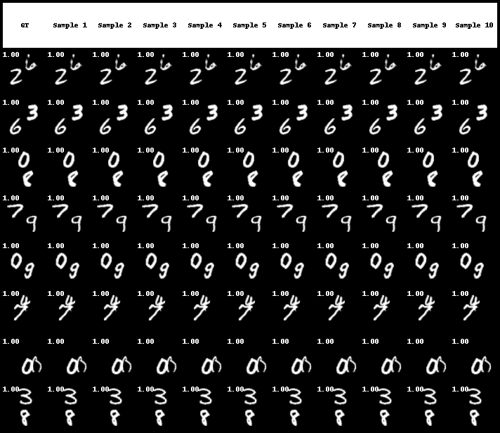

<h1 align="center"> STDiff: Spatio-temporal diffusion for continuous stochastic video prediction</h1>

<h3 align="center"> <a href="https://github.com/XiYe20/STDiffProject" target="_blank">Code</a> <h3>

&nbsp;

<h2 align="left"> Code is coming soon.

<h2 align="left"> Uncurated prediction examples of STDiff for multiple datasets. </h2> 
The temporal coordinates are shown at the top left corner of the frame. <em>Frames with  Red temporal coordinates  denote future frames predicted by our model.</em>

<h3 align="left">  BAIR </h3>

<h3 align="center">  </h3>

<h3 align="center">  </h3>

<h3 align="left">  SMMNIST </h3>

<h3 align="center">  </h3>

<h3 align="center">  </h3>

<h3 align="left">  KITTI </h3>

<h3 align="center">  </h3>

<h3 align="center">  </h3>

<h3 align="left">  Cityscapes </h3>

<h3 align="center">  </h3>

<h3 align="center">  </h3>
